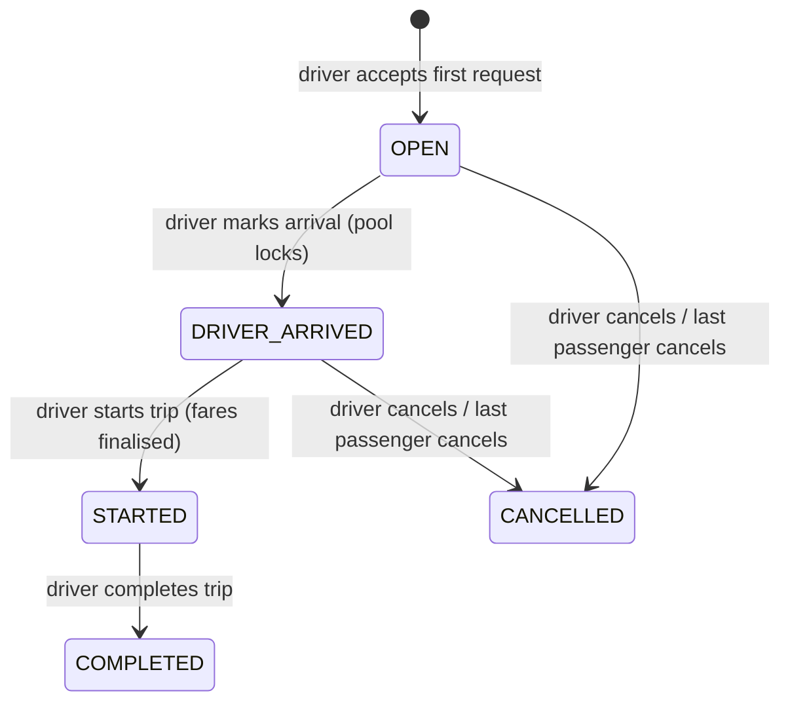
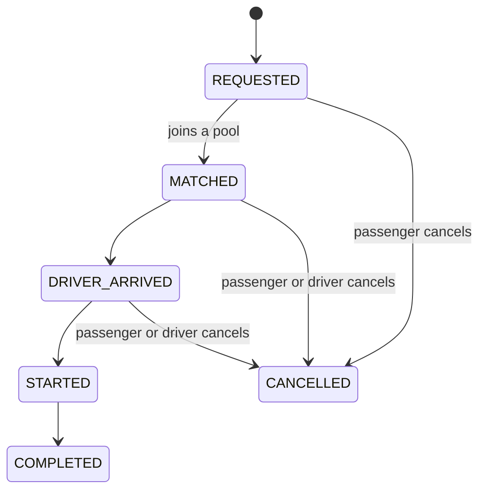
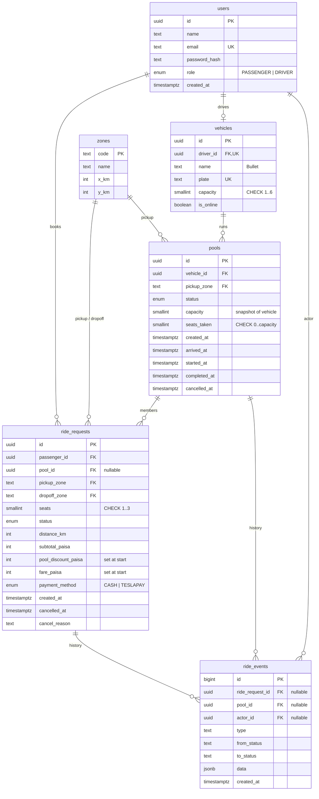
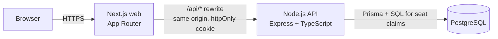

# Dhaka Tesla Pool — Design

This document was written before implementation. When the code diverges, this file is updated in the same branch.

## 1. Cast (used in seed data, tests and demo)

| Who | Role | Notes |
|---|---|---|
| Jashim | Driver | Owns **Bullet**, a 3-seat battery rickshaw ("Tesla") |
| Nusrat | Passenger | Banani → Mohakhali, late for work |
| Rafiq | Passenger | Banani → Gulshan 1, two minutes after Nusrat |
| Shirin | Passenger | Tries to grab Bullet's last seat thirty seconds later |

## 2. Assumptions

1. **Geography is a fixed list of zones.** Every zone has approximate coordinates on a km grid, with Banani at the origin. There are no real maps or routing.
2. **Distance is Manhattan distance** between zone coordinates, in whole km: `|x1-x2| + |y1-y2|`. Dhaka roads are closer to a grid than to a straight line, and you can work the result out by hand.
3. **Drivers cannot sign up themselves.** In real life a driver and vehicle have to be verified first, so drivers and their Teslas come from seed data. Passengers can sign up.
4. **One driver has one Tesla, and one Tesla has at most one active pool.**
5. **A passenger has at most one active ride request.** Nobody books two rickshaws at once.
6. **A pool locks when the driver marks arrival.** After `DRIVER_ARRIVED` nobody new can join. Jashim needs a final list of who is riding before he leaves.
7. **Final fares are set when the trip starts.** Pool membership can't change after that, so it's the first moment the system knows for certain whether you shared.
8. **Payment is recorded, not processed.** It's Cash or a simulated TeslaPay. No gateway is involved.
9. **Status updates use polling every few seconds**, not WebSockets. Rides take minutes, so a 3-second delay doesn't matter.

## 3. Zones

| Code | Name | x (km) | y (km) |
|---|---|---|---|
| BANANI | Banani | 0 | 0 |
| GULSHAN_2 | Gulshan 2 | 1 | 0 |
| GULSHAN_1 | Gulshan 1 | 1 | -2 |
| MOHAKHALI | Mohakhali | 0 | -2 |
| BASHUNDHARA | Bashundhara | 2 | 2 |
| UTTARA | Uttara | -1 | 9 |
| MIRPUR | Mirpur | -4 | 1 |
| FARMGATE | Farmgate | -1 | -4 |
| DHANMONDI | Dhanmondi | -3 | -5 |
| MOTIJHEEL | Motijheel | 1 | -7 |

## 4. Matching rule

A new request **R** can join an existing pool **P** only when all of these are true:

1. P is `OPEN`: a driver has accepted it and hasn't arrived yet.
2. R starts in the **same pickup zone** as P.
3. R's destination is **within 2 km** (Manhattan distance) of the destination of **every** active member of P. Everyone has to be heading the same way.
4. P has enough free seats: `seats_taken + R.seats <= capacity`. The database checks this atomically (see §8).

If more than one pool qualifies, R joins the **fullest** one, and ties go to the oldest. Filling a Tesla before starting another uses fewer vehicles.

**Applied to the story:** Nusrat goes Banani → Mohakhali (0,-2). Rafiq goes Banani → Gulshan 1 (1,-2). They have the same pickup zone, and their destinations are `|0-1| + |-2-(-2)| = 1 km` apart, which is ≤ 2 → **they can pool**. If Shirin went Banani → Gulshan 2 (1,0) instead, she would be 3 km from Nusrat's destination and would **not** be matched with them.

**How a request gets into a pool:**
- **Automatically:** when a request is created and a compatible open pool exists, it joins right away and becomes `MATCHED`.
- **By a driver:** a request that didn't match stays `REQUESTED` and shows up in online drivers' feeds. A driver with no active pool can accept any waiting request, which starts a new pool. A driver who already has an `OPEN` pool only sees requests that are compatible with it.

Both paths go through the same `joinPool` function, so capacity and compatibility are enforced in exactly one place.

## 5. Fare model

All money is stored as **integer paisa** (৳1 = 100 paisa) in `INTEGER` columns.

```
distanceKm     = manhattan(pickup, dropoff)
subtotal       = (BASE_FARE + PER_KM × distanceKm) × seats
poolDiscount   = floor(subtotal × POOL_DISCOUNT_PCT / 100)   if the trip was shared, else 0
passengerFare  = subtotal − poolDiscount
```

| Constant | Value |
|---|---|
| BASE_FARE | 3000 paisa (৳30) |
| PER_KM | 2000 paisa (৳20/km) |
| POOL_DISCOUNT_PCT | 25 |

A trip counts as **shared** if the pool has 2 or more active requests when it `STARTED`.

**Check it by hand (Nusrat and Rafiq pooled, 1 seat each):**

| | km | subtotal | discount | fare |
|---|---|---|---|---|
| Nusrat (Banani → Mohakhali) | 2 | 3000 + 4000 = 7000 | 1750 | **5250 (৳52.50)** |
| Rafiq (Banani → Gulshan 1) | 3 | 3000 + 6000 = 9000 | 2250 | **6750 (৳67.50)** |

If they had each ridden alone, the fares would be ৳70 and ৳90.

**Why integers and not floats or DECIMAL?** Floating-point numbers can't represent 0.1 exactly, so sums drift. DECIMAL is exact, but the Node `pg` driver returns it as a string, and it's easy to accidentally do float maths on it. With integer paisa, every amount is exact and every calculation is plain integer maths. We only format it as ৳ at display time. BASE_FARE and PER_KM are multiples of 1000 paisa, so the 25% discount always comes out to whole paisa. `floor` is there anyway so the rounding direction is explicit (it favours the platform by less than 1 paisa).

## 6. Lifecycle

The PRD suggests a single status. We split it into **two linked state machines**: one for the pool (the Tesla's trip) and one for each passenger's request. The reason is that in a pool, Rafiq cancelling must not cancel Nusrat's ride.

### Pool (the Tesla's trip)



### Ride request (one passenger)



Once a pool has members, request statuses after `MATCHED` follow the pool's status. They are updated **in the same transaction** as the pool, so the two can't disagree.

### Rules
- Any transition not shown above is rejected with `409 Conflict`. That includes starting a trip that hasn't had an arrival, and cancelling after `STARTED`.
- Passengers can cancel up until `STARTED`. Cancelling gives the seats back. If nobody active is left in the pool, the pool becomes `CANCELLED` and the Tesla is free.
- A driver can't go offline while they have an active pool.
- A driver's feed of "relevant requests" is empty while they're offline or a trip is underway. With no trip, it shows every waiting request that fits in the Tesla, oldest first. With an `OPEN` trip, it shows only requests that pass the matching rule and fit in the seats left.
- When the driver cancels, every active passenger becomes `CANCELLED` with the reason "Driver cancelled the trip". They can book again straight away.
- Every transition writes a row to `ride_events`, so we can later explain exactly what happened.

### Access rules
- Only passengers can request rides, and only drivers can use driver endpoints. A wrong role gets `403`.
- Ride lookups always filter by the signed-in passenger's id. Asking for someone else's ride returns `404`, not `403`, so the API doesn't even confirm the ride exists.
- A passenger sees their own fare and status, and only a **count** of co-riders, never their names or destinations. The driver sees every passenger in their own pool, because Jashim needs to know who is riding.

## 7. Database schema



### Why the tables look like this
- **Pool membership is `ride_requests.pool_id`, not a join table.** A request belongs to at most one pool. A `pool_members` join table would let a request be in two pools, and then we'd need extra code to stop that. The foreign key makes that state impossible to store.
- **`pools.capacity` is a copy of the vehicle's capacity** taken when the pool is created. The seat check then only needs the pool row, which is the row we lock, and changing Bullet's details later can't change past trips.
- **`pools.seats_taken` is a stored counter, not `SUM(seats)` computed each time.** A single row is something we can update atomically. A `SUM` over many rows can't be protected by a simple row lock.
- **`ride_events` is append-only.** It's the audit trail, so rows are never updated or deleted.

### Constraints and indexes
- `CHECK (seats_taken >= 0 AND seats_taken <= capacity)` on `pools`. If the application code has a bug, the database still refuses to overbook.
- `CHECK (pickup_zone <> dropoff_zone)` and `CHECK (seats BETWEEN 1 AND 3)` on `ride_requests`.
- Partial unique index: **one active pool per vehicle**, `UNIQUE (vehicle_id) WHERE status IN ('OPEN','DRIVER_ARRIVED','STARTED')`.
- Partial unique index: **one active request per passenger**, `UNIQUE (passenger_id) WHERE status NOT IN ('COMPLETED','CANCELLED')`.
- `ride_requests (status, pickup_zone)` index for the driver's feed. `ride_requests (passenger_id, created_at DESC)` index for passenger history. `ride_events (ride_request_id)` and `ride_events (pool_id)` indexes for history lookups.

## 8. Concurrency: the last seat

Bullet has 1 seat left. Nusrat and Shirin both see it and both press "Request" at the same moment.

We claim the seat with **one conditional UPDATE**:

```sql
UPDATE pools
SET seats_taken = seats_taken + $seats
WHERE id = $poolId
  AND status = 'OPEN'
  AND seats_taken + $seats <= capacity
RETURNING *;
```

1. Postgres takes a row lock on the pool row for the first UPDATE. The second UPDATE **waits**.
2. When the first transaction commits, Postgres (at READ COMMITTED) **checks the WHERE clause again** against the new row. Now `seats_taken + 1 <= capacity` is false, so the second UPDATE matches **0 rows**.
3. 0 rows means "this pool is full". That request then tries the next compatible pool, or stays `REQUESTED` and waits for a driver.
4. The `CHECK` constraint is a second line of defence. Even a buggy code path can't write `seats_taken > capacity`.

The seat claim, the request update and the event insert all happen in **one transaction**. If any of them fails, all of them are rolled back.

### Why there's also a `SELECT ... FOR UPDATE` lock
The conditional UPDATE is enough to protect **capacity**. It isn't enough to protect the **matching rule**. Suppose Bullet's pool has one member going to X, and two new requests arrive at once. Their destinations are each 2 km from X, but 4 km from each other. Each request is checked only against the members that were there when it started, so both pass their check, even though the two new riders aren't compatible with each other. So `joinPool` first locks the pool row (`SELECT ... FOR UPDATE`). It then reads the members, checks compatibility, and claims seats. Joins to the same pool happen one at a time, and each one sees the previous join's result.

### Lock order
Locks are always taken in the same order: **vehicle row, then pool row, then ride rows**. That applies to joining, cancelling and the driver's transitions. If one transaction held the ride and waited for the pool while another held the pool and waited for the ride, Postgres would have to kill one of them with a deadlock error. Always locking in the same order makes that impossible.

The vehicle lock is only needed for going online/offline and for accepting. Both lock Bullet's row, so Jashim can't press "Go offline" at the same instant he accepts a ride and end up offline with an open trip.

### How we know it works
[pooling.test.ts](../api/test/pooling.test.ts) fires Nusrat's and Shirin's requests at the same moment for Bullet's last seat. It also sends 8 passengers at once for 2 seats. As a check, we swapped the atomic claim for a naive "read `seats_taken`, then write `seats_taken + 1`" and removed the CHECK constraint. **Both tests then failed.** Both women got the seat, and all 8 commuters got into a 3-seat Tesla. With the real code, both tests pass.

Status transitions use the same pattern: `UPDATE ... WHERE id = $id AND status = $expected`. If two actions race (for example a double-clicked "Start trip"), exactly one of them succeeds and the other gets a `409`.

**At larger scale:** hot pools in the same zone would compete for row locks. The next step would be to partition matching by zone, so each zone is handled by one worker reading from a queue. Requests would carry idempotency keys so retries are safe. The row-level guarantee here would stay the same. See the scaling notes in the README.

## 9. Architecture



- **The browser only talks to Next.js.** Next.js rewrites `/api/*` to the Express API. Everything is then on one origin, so the JWT can sit in an **httpOnly cookie**: JavaScript can't read it, and we avoid CORS.
- **The API is a modular monolith** with `auth`, `rides`, `driver` and `pools` modules. Each has routes → service → data access. Business rules (matching, fares, transitions) live in services and are unit tested without HTTP.
- We use **REST**. The resources (rides, pools) map cleanly to URLs. State changes are explicit command endpoints (`POST /pool/start`) instead of a generic `PATCH status`, because each transition has its own rules and side effects.
