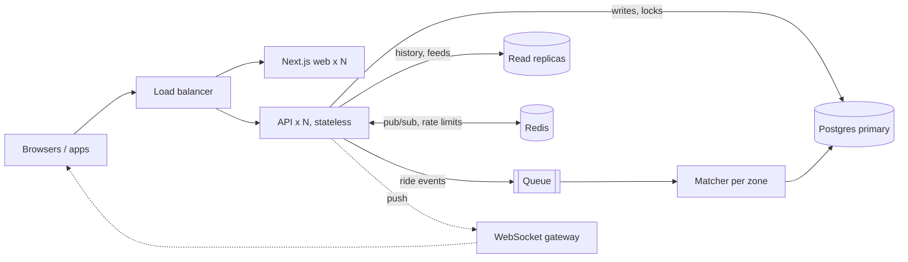

# If Oi Tesla Goes Viral: scaling to 1M passengers and 100k drivers

The MVP is one API process, one Next.js process and one Postgres. That's the right size for now: every rule that matters (capacity, one active ride per passenger, one trip per Tesla, state transitions) is enforced **inside Postgres transactions**, so it stays correct no matter how many API processes run. This page is how it would grow, and what would change first. Nothing here is built.

## Rough numbers
- 1M passengers, maybe 10% riding on a busy day: **100k rides a day**, peaking around **20–30 ride requests a second** at 8–9 AM.
- 100k drivers polling every 3 s: **~33k requests a second** of reads. This, not the booking writes, is the first thing that hurts.
- Writes are small and short: a booking is a handful of rows in one transaction.

## Target shape

## What changes, in the order it would be needed

1. **Horizontal API and web behind a load balancer.** Both are already stateless (the session is a signed JWT cookie; nothing lives in process memory except the rate limiter, see 4). Run N copies; health checks already exist (`/api/health` checks the database).
2. **Replace polling with push.** 33k polls a second is wasted work, because most answers are "nothing changed". A WebSocket (or Server-Sent Events) gateway pushes "your ride changed" from the ride events we already write. Polling stays as the fallback when a phone's connection drops.
3. **Read replicas for reads that can be a second stale:** ride history, trip history, the zone and spot lists (also cacheable for hours, since they're reference data). Everything that decides something (joining, seat claims, transitions) stays on the primary.
4. **Shared rate limiting and idempotency.** The in-memory login limiter becomes per-instance once there are many API processes, so it moves to Redis. Booking gets an **idempotency key** from the client, so a retry after a timeout returns the same ride instead of hitting "you already have an active ride".
5. **Matching per zone, off the request path.** Today a booking tries to join a trip inside the HTTP request, and hot zones (Banani at 8:40) would pile up on the same pool rows. Next step: a booking is saved and put on a queue **partitioned by pickup zone**. One matcher worker per zone takes them in order, so joins to the same trips never compete for locks. The seat claim stays exactly the same (`UPDATE ... WHERE seats_taken + n <= capacity`), so correctness doesn't depend on the queue.
6. **Real geography.** Replace the km grid with coordinates plus a spatial index (PostGIS `geography` + GiST index, or H3 cells). Candidate trips become "OPEN trips whose meeting spot is within 500 m and whose destinations are compatible", found with an index instead of a scan. Road distances come from a routing service (OSRM self-hosted, or Google Distance Matrix), cached per spot pair.
7. **Database growth.** `ride_events` is append-only and grows fastest: partition it by month and archive old partitions. Rides and trips can be partitioned by city before anything needs sharding. Sharding by city is the natural split, because a trip never crosses cities.

## Failure and retries
- **Every write is one transaction**, so a crash mid-request leaves nothing half-done.
- **Conditional updates make retries safe.** A retried "Start trip" gets `409` instead of doing it twice.
- **Queue consumers are idempotent.** "Join ride X to trip Y" is checked against the ride's current status, the same way it is now.
- **Driver apps on bad connections** retry with backoff. The server's state machine rejects anything out of order.

## Observability
- **Logs:** structured JSON logs (pino) already carry request ids. Add metrics: booking-to-match time per zone, match rate, `409` rate (contention), p95 latency, and pool lock wait time from `pg_stat_activity`.
- **Alerts:** match rate dropping in one zone, or lock waits rising.

## Security at scale
- **Sessions:** short-lived access tokens, with refresh tokens stored server-side so logout and "log out everywhere" really revoke.
- **Drivers:** verified onboarding.
- **Personal data:** passenger locations kept minimal and deleted after a retention period.
- **Secrets:** in a secret manager, not in environment files.

## What I would not do yet
No microservices, no Kafka, no Kubernetes for this load. A few stateless API instances, one Postgres primary with replicas, Redis and one queue cover 1M passengers comfortably. Each step above is added when a measured problem appears, not before.
